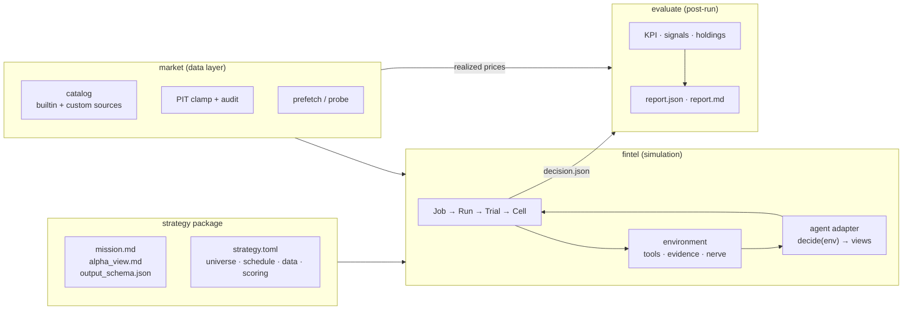
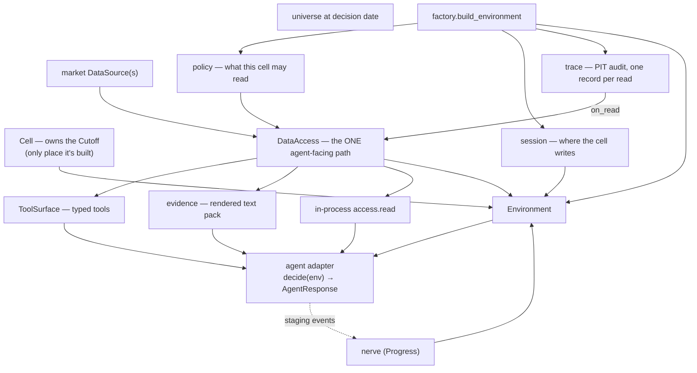

# fintel — architecture

A benchmark evaluation platform for financial agents. You bring a **strategy
package** (the benchmark), name an **agent**, and fintel runs the simulation
and scores the outcome.

## 1. Overview




### Financial agent eval vs terminal agent eval


|                         | Terminal benchmarks                                 | Financial agent eval (fintel)                            |
| ----------------------- | --------------------------------------------------- | -------------------------------------------------------- |
| **Task**                | Complete a terminal task                            | Make a point-in-time investment decision                 |
| **Environment**         | Container / shell                                   | PIT-controlled data with real market complexity          |
| **Validation**          | Runtime — task completes = done                     | Post-run — cross-sectional IC, final NAV                 |
| **Cell independence**   | Each task independent                               | Cell outcome depends on strategy + cross-sectional cells |
| **Benchmark ownership** | Developer-designed, generalizable                   | Personal — your strategy, your benchmark                 |
| **Who leverages it**    | LLM/harness owners demonstrating general capability | Investors leveraging AI for their own decisions          |


Terminal benchmarks are designed by developers, generalized, and used by
LLM/harness owners to demonstrate general capability. Financial agent eval is
personal: highly dependent on your own strategy — whether fundamental stock
rating, asset allocation, factor rotation, or crypto arbitrage. Investors
leveraging AI to make financial decisions need to own their own benchmark.
Hence the architecture: the strategy package **is** the benchmark.

### Two parallel concerns

An investment strategy entails far more than the judgment itself — it is the
full specification of *what* you trade, *when* you decide, *what data* feeds
the decision, *how* views become a signal, *what good* means, and *over what
horizon*. fintel encapsulates the parallel concern: the controlled, scalable,
PIT-faithful machinery to execute any such strategy and measure its outcome.


| | Encapsulates | Brings |
|---|---|---|
| **Strategy package** | the investment strategy | universe, schedule, decision scope, data kinds + params, mission + optional alpha view + output contract, signal, KPI, horizons, holdings params |
| **Agent** | how the mission gets executed | model, sampling, channel choice, internal decomposition |
| **Platform (fintel)** | the evaluation harness | PIT guarantee, data serving, orchestration, concurrency, ensemble, holdings/returns math, stochasticity, report |


The same package run under two agents is the same evaluation; agents may
consume the offered world differently. That is the agent's business — not the
package's, and not the platform's.

**Conformance test:** two dissimilar packages must both run end-to-end with
zero edits under `fintel/`. If one needs a platform change, the boundary is
wrong.

## 2. Execution hierarchy & artifacts

```
Job          one `fintel simulation` invocation: package × agent × market × K
 └─ Run      one of K repeats — the stochasticity unit
    └─ Trial      one decision date
       └─ Cell     one agent invocation
                   scope=single_name  → one cell per symbol
                   scope=portfolio    → one cell for the whole universe
```

Cell is a real orchestration level — that's what makes fan-out agent-agnostic,
puts retry where the missing thing lives, and lets one concurrency engine
cover every level.

### On-disk layout

```
runs/<job_id>/
  config.json  result.json  job.log  prefetch.json  health.json
  r1/ … rK/
    config.json  result.json  run.log
    trials/<YYYY-MM-DD>/
      decision.json          reduced once, after the fan-in
      result.json
      cells/<cell>.json      one writer each  (CellRecord)
      trace/<cell>.jsonl     one writer each
    sessions/…               agent workspace (access.jsonl, dossier, …)
  report/                   evaluation output (fintel report)
    report.json  report.md
    window-YYYYMMDD.json     optional same-period sidecar (`fintel report --start`)
  cache/                     shared central cache (one root, atomic, lock-merged)
```

Every level writes the same pair: `config.json` (asked + fingerprint) and
`result.json` (happened). `r1` exists even when K=1 — predictable tooling beats
a special case. One central cache root (`runs/cache/`, overridable with
`--cache-root` or `FINTEL_CACHE`); `fintel cache status` reads gap-aware
coverage sidecars.

## 3. The manifest

```toml
schema_version = 1
name = "my_strategy"
description = "…"

[universe]
preset = "dow30"                 # or: symbols = ["AAPL", "MSFT"]

[decision]
scope = "single_name"            # or portfolio
schedule = { kind = "custom_dates", start = "…", end = "…", dates = […] }
# also: kind = "quarterly" with start/end

[[data]]
kind = "prices"
source = "massive_prices"        # catalog name or "module:Callable"

[[data]]
kind = "fundamentals"
source = "massive_fundamentals"

[scoring]
signal = "single_name"           # builtin or "mypkg.scoring:my_signal"
kpi = "single_name_ir"          # builtin or "mypkg.scoring:my_kpi"
metric_key = "icir"
transform = "single_name"        # builtin or module:Callable
horizons = [1, 2, 4, 8]         # steps on the decision-date grid
params = { holdings = true, active_budget = 0.5, cost_bps = 5.0 }
```

`extra="forbid"` on the manifest — typos are errors, not silently ignored keys.
Unknown keys inside a `[[data]]` block become `params` for the resolved
source — the extension seam.

> **Authoring a package:** see `[add_strategy_package_guide.md](add_strategy_package_guide.md)`
> for the full guide, including how to bring your own data source.

## 4. Data & PIT

Three separable concepts:


|            |                         |                                          |
| ---------- | ----------------------- | ---------------------------------------- |
| **kind**   | what the agent asks for | `prices`                                 |
| **source** | who answers             | `massive_prices`, `synthetic_prices`     |
| **fields** | what comes back         | `open`, `high`, `low`, `close`, `volume` |


`market/catalog.py` is the library — every source registers its kind, fields,
params, and required env vars. Browse before picking:
`catalog.sources(kind="prices")`. A source with no declared fields is refused.


| kind             | source(s)                            | PIT clamp                                 |
| ---------------- | ------------------------------------ | ----------------------------------------- |
| `prices`         | `massive_prices`, `synthetic_prices` | bar date `< decision_date`                |
| `fundamentals`   | `massive_fundamentals`               | `filing_date < decision_date`             |
| `news`           | `massive_news`, `alphavantage_news`  | `published_at < decision_date`            |
| `filing_text`    | `massive_filing_text`                | `filing_date < decision_date`             |
| `macro`          | `fred_macro`                         | observation date `< decision_date`        |
| `ratios`         | `valuation_ratios` (computed)        | inherited from upstreams                  |
| `news_sentiment` | `news_sentiment` (computed)          | inherited from upstream                   |
| `web_search`     | `web_search`                         | freshness window ends `decision_date - 1` |


**PIT is structural, not advisory.** `fetch` takes a `Cutoff`, never a bare
date. Every read is policy-checked → clamped → recorded. Absence and failure
are different answers (`ok` / `empty` / `failed` / `denied`). The universe is
enforced on reads, not only at submission.

**The one deliberate exception:** `market/realized.py` is the only module
allowed to read *after* the decision date — scoring must measure what
happened. Different module, different name (`PriceLookup.price_at`, not
`fetch`), and a test forbidding `environment/`, `agents/`, `pit/` from
importing it.

**Prefetch** warms the cache before any cell runs. One lookback per kind
(`[[data]].lookback_days`) is what every consumer uses — prefetch, probe,
tools, evidence — so they can't drift. Probe checks reachability per kind
before any LLM call is paid for.

> **Cache details:** see `[data_pipeline.md](data_pipeline.md)`.

## 5. The environment

Where the three inputs meet for exactly one agent invocation. Built from
strategy + market + runtime, then handed to the agent adapter — which never
reaches for data itself but chooses a delivery channel and emits staging
events back to the nerve.




The invariants the diagram encodes: `agents/` never reaches `market/` or
`pit/`; tools and evidence share one `DataAccess` so they can't drift apart;
the audit stream (`log`) and live stream (`nerve`) are two concerns with two
sinks but one owner.

### Three delivery channels, one path


| channel         | for                                         | built from                             |
| --------------- | ------------------------------------------- | -------------------------------------- |
| in-process call | a desk fetching directly in Python          | `access.read(kind, **q)`               |
| typed tools     | function-calling agents (MCP, native tools) | `ToolSurface.descriptors()` + `call()` |
| rendered text   | single-turn agents needing one dump         | `evidence.build(access)`               |


All three are thin presentations of `DataAccess.read`. Repeated reads inside
a cell are memoized; failures are never memoized.

### Concurrency


| axis                 | flag                   | what it controls                                            |
| -------------------- | ---------------------- | ----------------------------------------------------------- |
| cells within a trial | `--cell-concurrency`   | tickers decide concurrently (auto = universe size)          |
| dates within a run   | `--trial-concurrency`  | default 1 (memory/feedback couples dates)                   |
| K repeats            | `--max-concurrent`     | repeats in parallel (auto = K)                              |
| flat pool            | `--shared-concurrency` | N cells in flight across all dates (blocked when memory on) |


The agent is built fresh per cell — correctness (trace accumulation on
`self` makes shared instances unsafe), not performance.

## 6. Agents

`agents/` holds one adapter per agent behind an `AgentFactory` name map. The
contract: `decide(environment) -> AgentResponse` — a returned value, not a
`submit()` callback.

### Two hosts


| host                     | agents                                     | data delivery                                             |
| ------------------------ | ------------------------------------------ | --------------------------------------------------------- |
| **in-process**           | `llm`, `scripted`, `constant`, `optimized` | `DataAccess` / tool objects directly                      |
| **subprocess CLI + MCP** | `openclaw`, `claude_code`                  | fintel MCP server rebuilds `Environment` from session dir |


The MCP server lives in `environment/` (not `agents/`) because it rebuilds
the environment — which requires `market.factory` — and `agents/` is barred
from importing `market/`.

Every adapter is offered the pack's `mission_text` (rubric composed with the
resolved alpha view for that decision date) and `alpha_view_text` (the view
block alone). Single-prompt agents use the composed mission; multi-call
agents also feed `alpha_view_text` to sub-agents that never see the rubric.

### What makes agents comparable

1. `**agents/` cannot import `market/` or `pit/**` — an adapter that can
  fetch its own data measures the evidence channel, not the agent.
2. **Typed outcomes** — `abstained`/`refused` (real answers) vs
  `timeout`/`rate_limited`/`parse_error` (retryable). Only `RETRYABLE`
   outcomes are retried; re-rolling a refusal manufactures a different
   answer.
3. **Cost basis** — `Usage.basis` records `reported` vs `estimated` so a
  sum degrades to `mixed` and stops being comparable.
4. **Channel is a platform knob** — tools and pack are two renderings of
  one `DataAccess`, so switching is a measurement, not an internal tweak.

### Fingerprint

`agents/fingerprint.py` covers every adapter uniformly: agent name, model,
channel, prompt hash, data kinds, adapter params. The channel is part of the
digest, so a channel ablation is a different run. Sealed into
`rK/config.json` before any trial runs.

### PIT tool policy

Every adapter declares `pit_enforcement`:

- `**access**` — in-process hosts. Every read goes through `Environment.access`
(already PIT-clamped).
- `**cli_deny**` — subprocess CLIs. At each cell launch: apply the platform
deny list for threat channels (uncontrolled web, free filesystem, shell
egress) and isolate MCP to the fintel server. Sub-agents, plan tools, and
session status stay on (ability, not knowledge egress).

> **Adding an agent:** see `[add_new_agents_guide.md](add_new_agents_guide.md)`.

